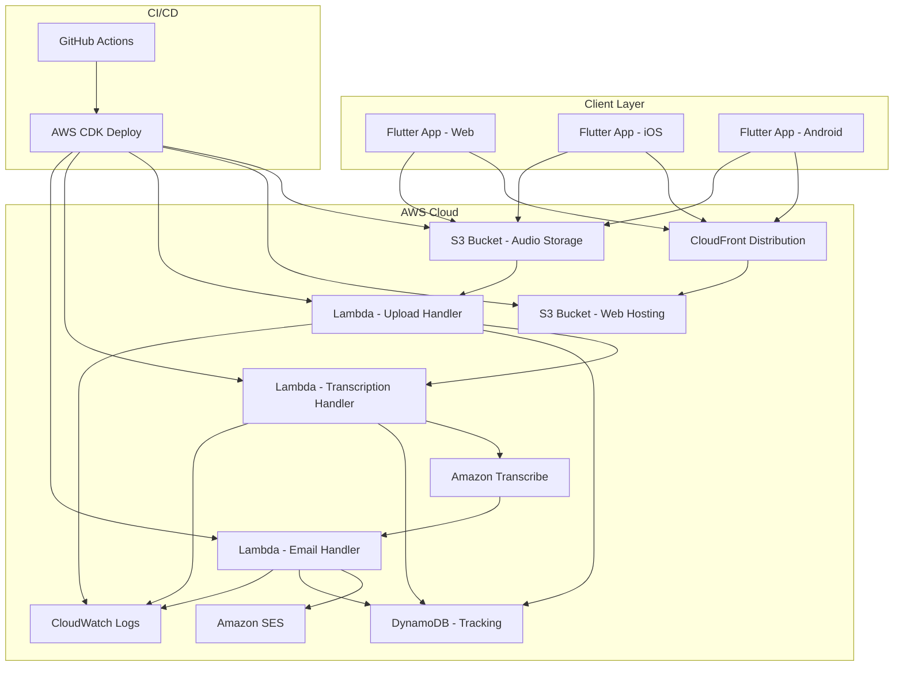

# Design Document

## Overview

The speech-to-email application is a serverless, event-driven system that enables users to record speech through a Flutter app and automatically converts it to text for email delivery. The architecture leverages AWS managed services for scalability, reliability, and cost-effectiveness, with infrastructure defined using AWS CDK and automated deployment through GitHub Actions.

## Architecture

### High-Level Architecture



### Event Flow

1. User records audio in Flutter app
2. Audio file uploaded directly to S3 with presigned URL
3. S3 upload triggers Lambda function (Upload Handler)
4. Upload Handler initiates Transcribe job and updates tracking in DynamoDB
5. Transcribe completion triggers Lambda function (Transcription Handler)
6. Transcription Handler retrieves text and triggers Email Handler
7. Email Handler formats and sends email via SES
8. Status updates propagated back to client through polling or WebSocket

## Components and Interfaces

### Flutter Frontend

**Technology Stack:**
- Flutter 3.16+ (latest stable)
- Dart 3.2+
- Platform-specific plugins for audio recording
- HTTP client for API communication
- State management using Provider or Riverpod

**Key Components:**

1. **Audio Recording Service**
   - Uses `flutter_sound` or `record` package for cross-platform audio recording
   - Handles platform-specific permissions
   - Manages recording state and file operations

2. **Upload Service**
   - Implements S3 presigned URL upload
   - Provides upload progress tracking
   - Handles retry logic and error states

3. **UI Components**
   - Recording interface with visual feedback
   - Upload progress indicators
   - Status notifications and error handling

**Platform Considerations:**
- Web: Uses MediaRecorder API through Flutter web plugins
- iOS: Requires microphone permissions in Info.plist
- Android: Requires RECORD_AUDIO permission in manifest

### Backend Infrastructure

**AWS CDK Stack Structure:**

1. **Storage Stack**
   - S3 bucket for audio file storage with lifecycle policies
   - S3 bucket for Flutter web app hosting
   - CloudFront distribution for global content delivery

2. **Processing Stack**
   - Lambda functions for upload handling, transcription, and email
   - DynamoDB table for request tracking and status
   - IAM roles with least-privilege permissions

3. **Communication Stack**
   - Amazon Transcribe service configuration
   - Amazon SES for email delivery
   - CloudWatch for logging and monitoring

### Lambda Functions

**Upload Handler Lambda:**
```typescript
interface UploadEvent {
  Records: S3Event[];
}

interface ProcessingRecord {
  id: string;
  audioFileKey: string;
  status: 'uploaded' | 'transcribing' | 'completed' | 'failed';
  timestamp: string;
  transcribeJobName?: string;
}
```

**Transcription Handler Lambda:**
```typescript
interface TranscribeEvent {
  source: 'aws.transcribe';
  detail: {
    TranscriptionJobName: string;
    TranscriptionJobStatus: 'COMPLETED' | 'FAILED';
  };
}
```

**Email Handler Lambda:**
```typescript
interface EmailPayload {
  transcriptionText: string;
  originalFileName: string;
  timestamp: string;
  recordId: string;
}
```

## Data Models

### DynamoDB Schema

**Table: SpeechProcessingRecords**
```typescript
interface SpeechRecord {
  PK: string; // recordId
  SK: string; // 'RECORD'
  audioFileKey: string;
  status: ProcessingStatus;
  createdAt: string;
  updatedAt: string;
  transcribeJobName?: string;
  transcriptionText?: string;
  emailSentAt?: string;
  errorMessage?: string;
  retryCount: number;
}

type ProcessingStatus = 
  | 'uploaded' 
  | 'transcribing' 
  | 'transcription_completed' 
  | 'email_sent' 
  | 'failed';
```

### Audio File Naming Convention
```
audio-files/{year}/{month}/{day}/{recordId}.{extension}
```

### API Interfaces

**Presigned URL Request:**
```typescript
interface PresignedUrlRequest {
  fileName: string;
  fileSize: number;
  contentType: string;
}

interface PresignedUrlResponse {
  uploadUrl: string;
  recordId: string;
  expiresIn: number;
}
```

**Status Check:**
```typescript
interface StatusRequest {
  recordId: string;
}

interface StatusResponse {
  recordId: string;
  status: ProcessingStatus;
  transcriptionText?: string;
  errorMessage?: string;
  progress?: number;
}
```

## Error Handling

### Client-Side Error Handling

1. **Recording Errors**
   - Microphone permission denied: Show permission request dialog
   - Recording device unavailable: Display error message with retry option
   - Storage space insufficient: Alert user and suggest cleanup

2. **Upload Errors**
   - Network connectivity issues: Implement exponential backoff retry
   - File size too large: Validate before upload and show size limits
   - Authentication failures: Refresh credentials and retry

3. **Status Polling Errors**
   - API unavailable: Show offline mode message
   - Timeout errors: Implement circuit breaker pattern

### Server-Side Error Handling

1. **Lambda Function Errors**
   - Implement dead letter queues for failed processing
   - Use CloudWatch alarms for error rate monitoring
   - Structured logging for debugging and troubleshooting

2. **Transcribe Service Errors**
   - Handle unsupported audio formats gracefully
   - Implement retry logic for transient failures
   - Fallback to error notification if transcription fails

3. **Email Delivery Errors**
   - SES bounce and complaint handling
   - Retry logic with exponential backoff
   - Alternative notification methods if email fails

## Testing Strategy

### Frontend Testing

1. **Unit Tests**
   - Audio recording service functionality
   - Upload service with mocked HTTP responses
   - State management and business logic

2. **Widget Tests**
   - UI component behavior and interactions
   - Platform-specific permission handling
   - Error state rendering and user feedback

3. **Integration Tests**
   - End-to-end recording and upload flow
   - Cross-platform compatibility testing
   - Performance testing for large audio files

### Backend Testing

1. **Unit Tests**
   - Lambda function logic with mocked AWS services
   - CDK construct validation and synthesis
   - Data transformation and validation functions

2. **Integration Tests**
   - S3 event triggering and Lambda execution
   - Transcribe service integration
   - SES email delivery functionality

3. **End-to-End Tests**
   - Complete workflow from upload to email delivery
   - Error scenarios and recovery mechanisms
   - Performance and scalability testing

### Infrastructure Testing

1. **CDK Tests**
   - Stack synthesis and template validation
   - Security policy verification
   - Resource configuration compliance

2. **Deployment Tests**
   - GitHub Actions workflow validation
   - Multi-environment deployment testing
   - Rollback and disaster recovery procedures

## Security Considerations

### Authentication and Authorization

1. **Client Authentication**
   - Use AWS Cognito for user authentication (if user management needed)
   - Implement API key-based access for anonymous usage
   - Generate time-limited presigned URLs for S3 uploads

2. **IAM Policies**
   - Least-privilege access for all Lambda functions
   - Cross-service access controls
   - Resource-based policies for S3 and SES

### Data Protection

1. **Encryption**
   - S3 server-side encryption (SSE-S3 or SSE-KMS)
   - HTTPS/TLS for all API communications
   - Encrypted CloudWatch logs

2. **Data Retention**
   - Automatic deletion of audio files after processing
   - Configurable retention periods for transcription text
   - GDPR compliance considerations for EU users

### Network Security

1. **API Security**
   - Rate limiting and throttling
   - Input validation and sanitization
   - CORS configuration for web clients

2. **Infrastructure Security**
   - VPC configuration if needed for enhanced isolation
   - Security groups and NACLs
   - CloudTrail logging for audit trails

## Performance and Scalability

### Frontend Performance

1. **Audio Processing**
   - Client-side audio compression before upload
   - Progressive upload for large files
   - Background processing to maintain UI responsiveness

2. **Network Optimization**
   - CloudFront caching for static assets
   - Optimized bundle sizes for web deployment
   - Efficient state management to minimize re-renders

### Backend Scalability

1. **Lambda Configuration**
   - Appropriate memory and timeout settings
   - Concurrent execution limits and reserved capacity
   - Cold start optimization strategies

2. **Storage Optimization**
   - S3 intelligent tiering for cost optimization
   - Lifecycle policies for automatic cleanup
   - CloudFront caching strategies

3. **Monitoring and Alerting**
   - CloudWatch metrics and custom dashboards
   - Automated scaling based on usage patterns
   - Performance benchmarking and optimization