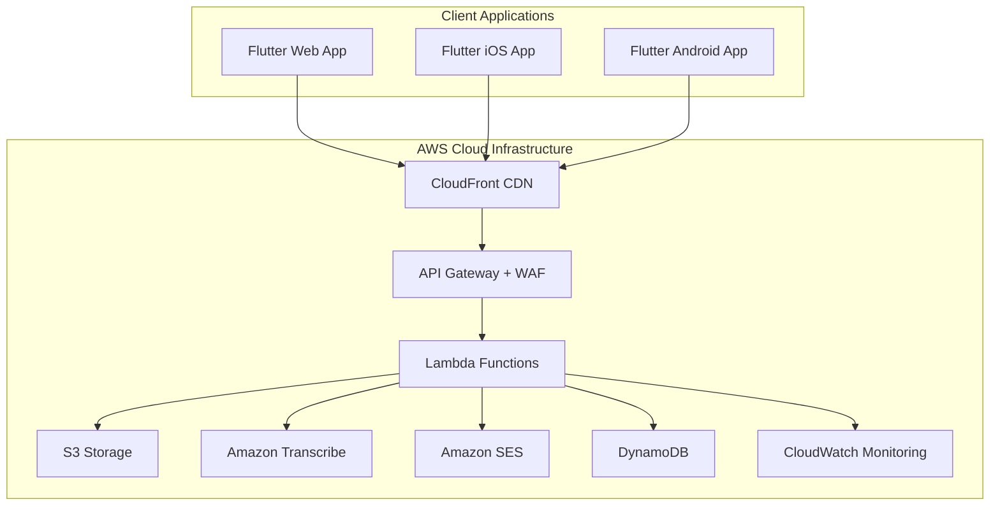

# 🎤 Speech to Email Application

A comprehensive Flutter application that records speech messages, converts them to text using AWS services, and sends them via email. Built with modern architecture, security best practices, and enterprise-grade monitoring.

## ✨ Features

### 🎯 Core Functionality
- **Cross-Platform Recording**: Works on Web, iOS, and Android
- **Intelligent Speech Processing**: Amazon Transcribe for accurate speech-to-text
- **Automated Email Delivery**: Sends transcribed messages via Amazon SES
- **Real-Time Progress Tracking**: Live updates throughout the entire process
- **Comprehensive Error Handling**: Smart retry mechanisms and user-friendly error messages

### 🔒 Security & Reliability
- **Enterprise Security**: WAF protection, encryption at rest/transit, input validation
- **Monitoring & Alerting**: CloudWatch dashboards, alarms, and structured logging
- **Scalable Architecture**: Serverless design with auto-scaling capabilities
- **Disaster Recovery**: Automated backups and cross-region replication ready

### 🚀 Performance Optimizations
- **Audio Compression**: Intelligent compression before upload
- **Progressive Upload**: Chunked uploads with progress tracking
- **Caching Strategy**: Smart caching for improved performance
- **CDN Distribution**: Global content delivery via CloudFront

## 🏗️ Architecture



## 🛠️ Technology Stack

### Frontend
- **Flutter 3.16+** - Cross-platform UI framework
- **Provider** - State management
- **Dio** - HTTP client with interceptors
- **Record** - Audio recording capabilities

### Backend
- **AWS CDK** - Infrastructure as Code
- **AWS Lambda** - Serverless compute
- **Amazon S3** - Object storage
- **Amazon Transcribe** - Speech-to-text service
- **Amazon SES** - Email delivery
- **DynamoDB** - NoSQL database
- **CloudWatch** - Monitoring and logging

### DevOps
- **GitHub Actions** - CI/CD pipeline
- **AWS CloudFormation** - Infrastructure deployment
- **Jest** - Backend testing
- **Flutter Test** - Frontend testing

## 🚀 Quick Start

### Prerequisites
- Flutter SDK 3.16.0+
- Node.js 18.x+
- AWS CLI configured
- Git

### 1. Clone Repository
```bash
git clone <repository-url>
cd speech-to-email
```

### 2. Backend Setup
```bash
cd speech-to-email-backend
npm install
npm run build
npx cdk deploy
```

### 3. Frontend Setup
```bash
cd speech_to_email_app
flutter pub get
flutter run
```

### 4. Configure Environment
```bash
# Set your API Gateway URL
export API_BASE_URL="https://your-api-gateway-url.execute-api.us-east-1.amazonaws.com/prod"
```

## 📱 Usage

1. **Record Speech**: Tap the microphone button to start recording
2. **Upload Audio**: The app automatically uploads your recording to AWS S3
3. **Processing**: Amazon Transcribe converts speech to text
4. **Email Delivery**: The transcribed text is sent via email
5. **Confirmation**: Receive real-time updates and completion notification

## 🔧 Configuration

### Environment Variables

#### Frontend (Flutter)
```bash
API_BASE_URL=https://your-api-gateway-url.com
```

#### Backend (AWS CDK)
```bash
AWS_REGION=us-east-1
RECIPIENT_EMAIL=johannes.koch@gmail.com
SENDER_EMAIL=noreply@yourdomain.com
```

### AWS Services Configuration

#### Amazon SES
```bash
# Verify sender email
aws ses verify-email-identity --email-address noreply@yourdomain.com
```

#### S3 Bucket Policies
- Audio storage bucket: Private with lifecycle policies
- Web hosting bucket: Public read access for static assets

## 🧪 Testing

### Frontend Tests
```bash
cd speech_to_email_app
flutter test
flutter test integration_test/
```

### Backend Tests
```bash
cd speech-to-email-backend
npm test
npm run test:coverage
```

### End-to-End Tests
```bash
# Run integration tests
npm run test:integration
```

## 📊 Monitoring

### CloudWatch Dashboard
Access real-time metrics at:
```
https://console.aws.amazon.com/cloudwatch/home?region=us-east-1#dashboards:name=SpeechToEmailMonitoring
```

### Key Metrics
- **Lambda Invocations**: Function execution counts
- **Error Rates**: Failed requests and processing errors
- **API Latency**: Response times across all endpoints
- **Storage Usage**: S3 bucket sizes and object counts
- **Email Delivery**: SES sending statistics

### Alerts
- High error rate (>5%)
- Dead letter queue messages
- API Gateway 5XX errors
- Lambda function timeouts

## 🔐 Security

### Data Protection
- **Encryption at Rest**: KMS encryption for S3 and DynamoDB
- **Encryption in Transit**: TLS 1.2+ for all communications
- **Input Validation**: Comprehensive sanitization and validation
- **Access Controls**: Least-privilege IAM policies

### Network Security
- **WAF Protection**: Rate limiting and common attack prevention
- **CORS Configuration**: Restricted cross-origin requests
- **API Throttling**: Request rate limiting
- **Security Headers**: HSTS, XSS protection, content type validation

## 📈 Performance

### Optimization Features
- **Audio Compression**: Reduces upload time and bandwidth
- **Progressive Upload**: Chunked uploads with resume capability
- **Caching Strategy**: API response caching and static asset optimization
- **CDN Distribution**: Global content delivery via CloudFront

### Benchmarks
- **Upload Speed**: ~2MB/minute on average connection
- **Processing Time**: 30-60 seconds for typical speech recordings
- **API Response**: <200ms for status checks
- **Cold Start**: <3 seconds for Lambda functions

## 🚀 Deployment

### Automated Deployment
The application uses GitHub Actions for automated CI/CD:

1. **Code Push**: Triggers automated testing
2. **Quality Gates**: Code analysis, security scanning, tests
3. **Build Process**: Compiles Flutter apps and CDK infrastructure
4. **Deployment**: Automated deployment to AWS
5. **Verification**: Post-deployment health checks

### Manual Deployment
See [DEPLOYMENT.md](DEPLOYMENT.md) for detailed deployment instructions.

## 🤝 Contributing

1. Fork the repository
2. Create a feature branch (`git checkout -b feature/amazing-feature`)
3. Commit your changes (`git commit -m 'Add amazing feature'`)
4. Push to the branch (`git push origin feature/amazing-feature`)
5. Open a Pull Request

### Development Guidelines
- Follow Flutter and TypeScript style guides
- Write comprehensive tests for new features
- Update documentation for API changes
- Ensure security best practices are followed

## 📄 License

This project is licensed under the MIT License - see the [LICENSE](LICENSE) file for details.

## 🆘 Support

### Documentation
- [Deployment Guide](DEPLOYMENT.md)
- [API Documentation](docs/api.md)
- [Architecture Overview](docs/architecture.md)

### Getting Help
- **Issues**: GitHub Issues for bug reports and feature requests
- **Discussions**: GitHub Discussions for questions and community support
- **Security**: Email security@company.com for security-related issues

### Troubleshooting
Common issues and solutions:

#### Recording Issues
- **Microphone Permission**: Ensure microphone access is granted
- **Browser Compatibility**: Use modern browsers (Chrome 70+, Firefox 65+)
- **File Size Limits**: Maximum 50MB per recording

#### Upload Issues
- **Network Connectivity**: Check internet connection
- **File Format**: Ensure audio format is supported (MP3, WAV, M4A, AAC)
- **API Limits**: Respect rate limiting (1000 requests per 5 minutes)

#### Processing Issues
- **Transcription Quality**: Speak clearly and minimize background noise
- **Language Support**: Currently supports English (US) only
- **Processing Time**: Allow 30-60 seconds for typical recordings

## 🎯 Roadmap

### Upcoming Features
- [ ] Multi-language support
- [ ] Real-time transcription
- [ ] Voice commands
- [ ] Batch processing
- [ ] Advanced audio filters
- [ ] Custom email templates
- [ ] User authentication
- [ ] Recording history management

### Performance Improvements
- [ ] WebRTC integration for better audio quality
- [ ] Edge computing for reduced latency
- [ ] Advanced compression algorithms
- [ ] Predictive preloading

---

**Built with ❤️ using Flutter and AWS**

For more information, visit our [documentation](docs/) or contact the development team.